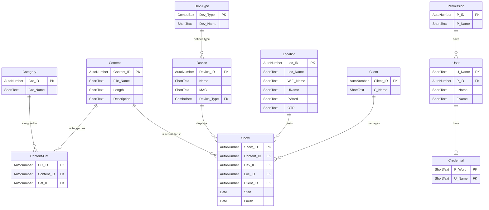

# 02 — Data Models & Database Schema

> Entity relationships and database design for SlideFlow, based on the custom ERD.

---

## Entity Relationship Diagram

---

## Table Descriptions

| Table | Description |
|-------|-------------|
| **Category** | Stores the different content categories used to organize content items. Each category has a unique ID and a name. |
| **Content** | Stores information about individual content items such as images or videos. This includes the file name, length, and a short description of the content. |
| **Content-Cat** | Acts as a linking table between Content and Category. It allows content to be assigned to one or more categories using foreign keys. |
| **Show** | Represents scheduled content playback. It links content to a specific device, location, and client, and includes start and finish times for when the content is shown. |
| **Device** | Stores information about display devices used to show content. This includes the device name, MAC address, and device type. |
| **Dev-Type** | Defines the type of device (for example, TV or Raspberry Pi). This table helps standardize device classifications across the system. |
| **Location** | Stores information about where devices are installed. This includes the location name and connection details such as WiFi name, username, password. |
| **Client** | Represents the organization or department that manages the content and displays. Each client has a unique ID and name. |
| **User** | Stores user account information for people who access the system. This includes the username and the user's first and last name. |
| **Permission** | Defines different permission levels or roles in the system. These permissions control what actions users are allowed to perform. |
| **Credential** | Stores login credential information associated with a user. This table links usernames to stored passwords for authentication purposes. |

---

## Data Dictionary

### Show

| Attribute | Description | Data Type | Format/Input Mask | Required | PK/FK | FK Ref Table | Sample Data | Field Length |
|-----------|-------------|-----------|-------------------|----------|-------|-------------|-------------|-------------|
| Show_ID | Employee code | AutoNumber | 000000 | Y | PK | | 123456 | |
| Content_ID | Code Content | AutoNumber | L0000 | Y | FK | Content | C0001 | |
| Device_ID | Code Device | AutoNumber | L0000 | Y | FK | Device | D0001 | |
| Location_ID | Location ID | AutoNumber | L0000 | Y | FK | Location | L0001 | |
| Client_ID | Client ID | AutoNumber | LL0000 | Y | FK | Client | CL001 | |
| Start | Start Show | Date | mm/dd/yyyy hh:nn AM/PM | Y | | | 11/07/2025 08:00 AM | |
| Finish | Finish Show | Date | mm/dd/yyyy hh:nn AM/PM | Y | | | 11/07/2025 10:00 AM | |

### Device

| Attribute | Description | Data Type | Format/Input Mask | Required | PK/FK | FK Ref Table | Sample Data | Field Length |
|-----------|-------------|-----------|-------------------|----------|-------|-------------|-------------|-------------|
| Device_ID | Code Device | AutoNumber | L0000 | Y | PK | | D0001 | |
| Name | Name Device | Short Text | | | | | TV | |
| MAC | MAC Address | Short Text | >AA\-AA\-AA\-AA\-AA\-AA | Y | | | BC-5F-F4-9A-21-7C | |
| Device_Type | Type device | Combo Box | | Y | FK | Dev_Type | Tv/Monitor/Pi | |

### Dev-Type

| Attribute | Description | Data Type | Format/Input Mask | Required | PK/FK | FK Ref Table | Sample Data | Field Length |
|-----------|-------------|-----------|-------------------|----------|-------|-------------|-------------|-------------|
| Device_Type | Type device | Combo Box | | Y | PK | | Tv/Monitor/Pi | |
| Device_Name | | Short Text | | Y | | | Tv-1 | |

### Client

| Attribute | Description | Data Type | Format/Input Mask | Required | PK/FK | FK Ref Table | Sample Data | Field Length |
|-----------|-------------|-----------|-------------------|----------|-------|-------------|-------------|-------------|
| Client_ID | Client ID | AutoNumber | LL0000 | Y | PK | | CL001 | |
| Client_Name | Client Name | Short Text | | Y | | | Dave Clark | |

### Location

| Attribute | Description | Data Type | Format/Input Mask | Required | PK/FK | FK Ref Table | Sample Data | Field Length |
|-----------|-------------|-----------|-------------------|----------|-------|-------------|-------------|-------------|
| Location_ID | Location ID | AutoNumber | L0000 | Y | FK | Location | L0001 | 5 |
| Location_Name | Name of Location | Short Text | | Y | | | North Building | 30 |
| Wifi_Name | Wifi Name | Short Text | | Y | | | North-Build | 30 |
| Uname | Username | Short Text | | Y | | | Username | 30 |
| Password | Password WiFi | Short Text | | Y | | | Password1 | 30 |
| OTP | OTP for WiFi | Short Text | 123456 | N | | | 571998 | 6 |

### Content

| Attribute | Description | Data Type | Format/Input Mask | Required | PK/FK | FK Ref Table | Sample Data | Field Length |
|-----------|-------------|-----------|-------------------|----------|-------|-------------|-------------|-------------|
| Content_ID | Code Content | AutoNumber | L0000 | Y | FK | Content | C0001 | 5 |
| File_Name | File Name | Short Text | | Y | | | welcome_lobby.mp4 | 30 |
| Length | Length of content | Short Text | 0:00 | N | | | 1:35 | 8 |
| Description | Short description | Short Text | | N | | | Promotion Banner | 30 |

### Content-Cat

| Attribute | Description | Data Type | Format/Input Mask | Required | PK/FK | FK Ref Table | Sample Data | Field Length |
|-----------|-------------|-----------|-------------------|----------|-------|-------------|-------------|-------------|
| CC_ID | Identifier for Cat–Cont | AutoNumber | | Y | PK | | 1 | 100 |
| Content_ID | Client ID | AutoNumber | LL0000 | Y | FK | Client | CL001 | 5 |
| Cat_ID | Category assigned to content | AutoNumber | LL0000 | Y | FK | Category | CA001 | 5 |

### Category

| Attribute | Description | Data Type | Format/Input Mask | Required | PK/FK | FK Ref Table | Sample Data | Field Length |
|-----------|-------------|-----------|-------------------|----------|-------|-------------|-------------|-------------|
| Cat_ID | Category assigned to content | AutoNumber | LL0000 | Y | PK | | CA001 | 5 |
| Cat_Name | Name of the category | Short Text | | Y | | | Promotion | 30 |

### Permission

| Attribute | Description | Data Type | Format/Input Mask | Required | PK/FK | FK Ref Table | Sample Data | Field Length |
|-----------|-------------|-----------|-------------------|----------|-------|-------------|-------------|-------------|
| P_ID | Permission ID | AutoNumber | PR0000 | Y | PK | | 6 | |
| P_Name | Permission Name | Short Text | | Y | | | | |

### User

| Attribute | Description | Data Type | Format/Input Mask | Required | PK/FK | FK Ref Table | Sample Data | Field Length |
|-----------|-------------|-----------|-------------------|----------|-------|-------------|-------------|-------------|
| U_Name | Username | Short Text | | Y | PK | | Ali1 | |
| P_ID | Password ID | AutoNumber | P0000 | Y | | | | 5 |
| LastName | Last Name | Short Text | | Y | | | Naas | |
| FirstName | First Name | Short Text | | Y | | | Mohamed | |

### Credential

| Attribute | Description | Data Type | Format/Input Mask | Required | PK/FK | FK Ref Table | Sample Data | Field Length |
|-----------|-------------|-----------|-------------------|----------|-------|-------------|-------------|-------------|
| P_Word | Password | Short Text | | Y | PK | | Password1 | |
| U_Name | Username | Short Text | | Y | | | Ali1 | |

---

## Relationships Summary

| Relationship | Type | Description |
|-------------|------|-------------|
| Content → Content-Cat | One-to-Many | A content item can be tagged with multiple categories |
| Category → Content-Cat | One-to-Many | A category can be assigned to multiple content items |
| Content → Show | One-to-Many | A content item can be scheduled in multiple shows |
| Device → Show | One-to-Many | A device can display multiple shows |
| Location → Show | One-to-Many | A location can host multiple shows |
| Client → Show | One-to-Many | A client can manage multiple shows |
| Dev-Type → Device | One-to-Many | A device type defines the classification of multiple devices |
| Permission → User | One-to-Many | A permission level can be assigned to multiple users |
| User → Credential | One-to-One | Each user has one set of login credentials |
